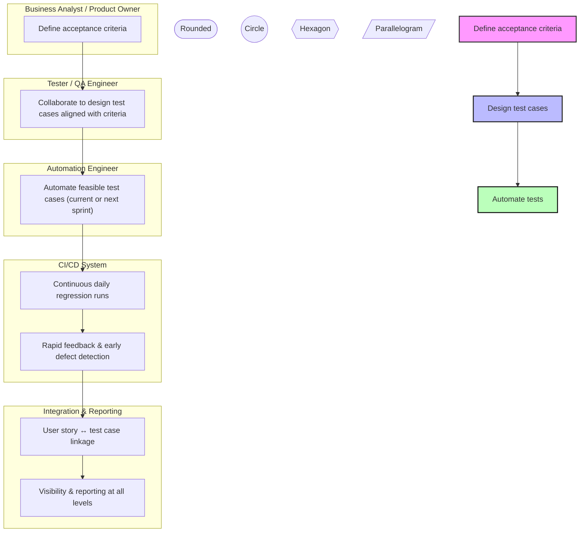

## This is a sample page of how to use Mermaid flowcharts

```mermaid
flowchart TD

    
    %% Roles / Tools
    subgraph BA["Business Analyst / Product Owner"]
        A1["Define acceptance criteria"]
    end

    subgraph QA["Tester / QA Engineer"]
        B1["Collaborate to design test cases aligned with criteria"]
    end

    subgraph AUTO["Automation Engineer"]
        C1["Automate feasible test cases (current or next sprint)"]
    end

    subgraph CI["CI/CD System"]
        D1["Continuous daily regression runs"]
        D2["Rapid feedback & early defect detection"]
    end

    subgraph TOOLS["Integration & Reporting"]
        E1["User story ↔ test case linkage"]
        E2["Visibility & reporting at all levels"]
    end

    %% Flow connections
    A1 --> B1 --> C1 --> D1 --> D2 --> E1 --> E2
    
    
        
    Z1["Rect"]
    Z2(["Rounded"])
    Z3((Circle))
    Z4{{Hexagon}}
    Z5[/Parallelogram/]
  
    Z1["Define acceptance criteria"]
    Y1["Design test cases"]
    X1["Automate tests"]

    Z1 --> Y1 --> X1
    %% Custom styles
    style Z1 fill:#f9f,stroke:#333,stroke-width:2px
    style Y1 fill:#bbf,stroke:#222,stroke-width:2px
    style X1 fill:#bfb,stroke:#111,stroke-width:2px
    %% Reusable class
    classDef qa fill:#bbf,stroke:#222,stroke-width:2px
    class Y1,X1 qa
  

```

