Welcome to QED, a modern, Kotlin-based test automation framework designed for clarity, composability, and speed. This guide walks you through setting up QED from scratch — no prior experience required.

## Prerequisites
Before you begin, make sure your system has:

Java JDK 22+ Install from Amazon Coretto or your preferred vendor. Check that JAVA_HOME is set to the correct directory in environment variables.
For example:

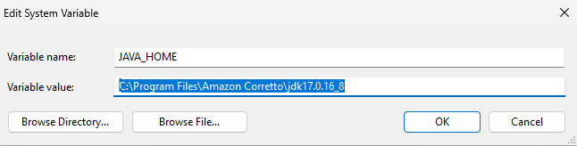

IntelliJ IDEA (Community Edition is fine) Download from JetBrains. Create the associations with .kt, .gradle, .java, .kts if you want these files to load automatically in IntelliJ.

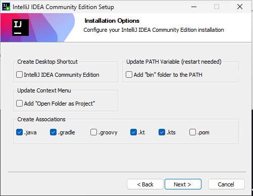

Git For cloning the repository (use all the default options).

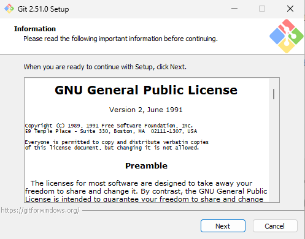

Check in a CLI that java and git have been installed:
```shell
java -version
git --version
```

## Step 1: Clone the QED Repository
It may be that github asks for credetials. Please follow the prompts and enter the credentials that were given.
```shell
git clone https://github.com/QED/qed.git
cd qed
```
## Step 2: Open in IntelliJ
Launch IntelliJ IDEA. 

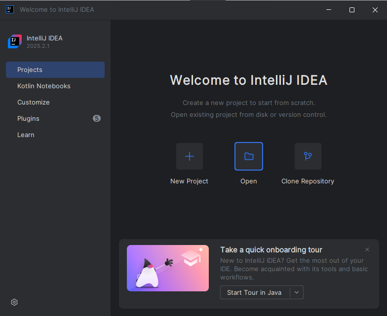

Select Open and choose the QED directory. 
Click 'trust' projects

In File | Settings |Appearance, you can choose the theme to your preference. In this documentation, the theme "Light" is chosen.

IntelliJ will detect the Gradle project and begin indexing.
If not, go to the right hand toolbar in IntelliJ, and click on the 'gradle' button (1), and then on the 'sync' button (2)
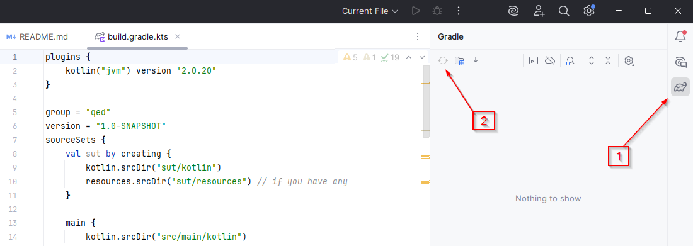

That should install all dependencies and should result in a successful build:
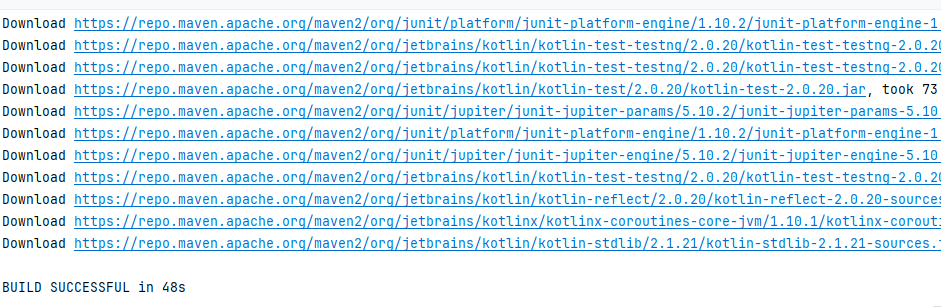

## Step 3: Configure Java & Gradle
Set Project SDK: Go to File → Project Structure → Project, and set the SDK to Java 17+.
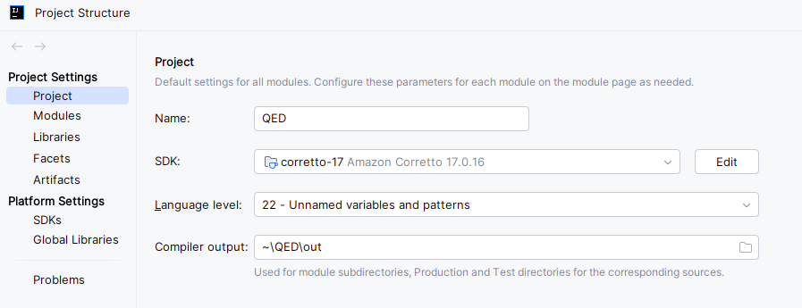

Gradle Settings: Ensure Gradle uses the correct JVM:

File → Settings → Build, Execution, Deployment → Build Tools → Gradle

Use Gradle from: ‘Gradle wrapper’

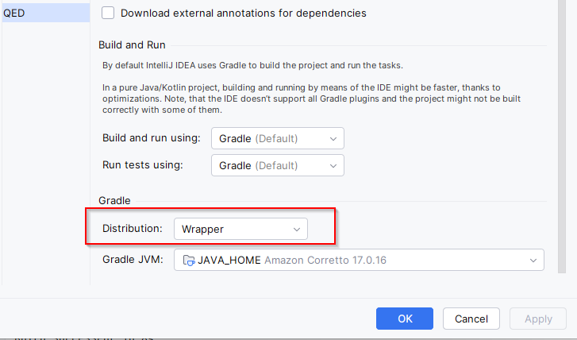

JVM: Java 17+

## Step 4: Build the Project
In IntelliJ (go to View | Tool WIndows | Terminal):
```shell
gradlew clean build
```
##Step 5: Run a Demo Test
QED includes demo SUTs to help you validate your setup.

Navigate to src/test/kotlin/E2E_UITestingPlayground/testcases

First, setup configurations. In InteliJ, in the top bar, click on 'Current File' and select 'Edit Configurations'

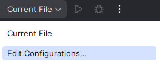

Then, click on the '+' in the top left corner of the dialog, and seect 'gradle'

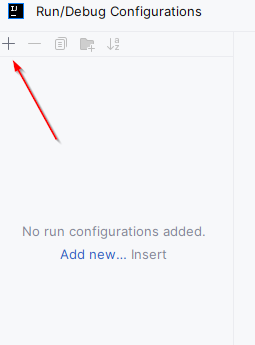

The configuration should be set as follows:

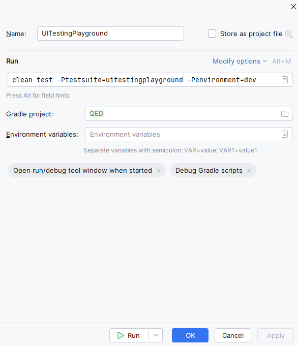

Click on the 'Run' button in the dialog. You can also click 'Ok', and then launch the suite from the top bar. 
The arrow button launches the suite, the bug button does the same, but allows to debug.

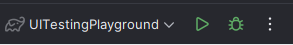

The 'Run' panel in IntelliJ should show that the tests are running. The first time around, 
this is fairly slow as the playwright dependencies need to be downloaded. 

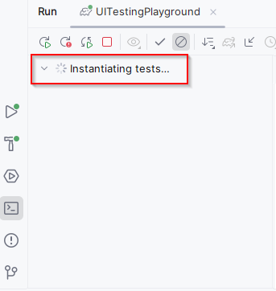

There will be one failure in the suite.
This was done on purpose to demonstrate how the report lookslike when a test fails.

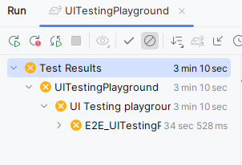

If you see the browser launch and the tests execute, you're good to go. When the tests have finished, you can view the report 
from the /build/test-otput/ExtentReport/TestExecutionReport.html

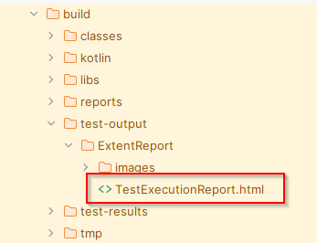

Right click on it and select 'Open in' | Browser | <Favorite Browser>
If you can view a report that looks like this, you have successfully run the demo suite.

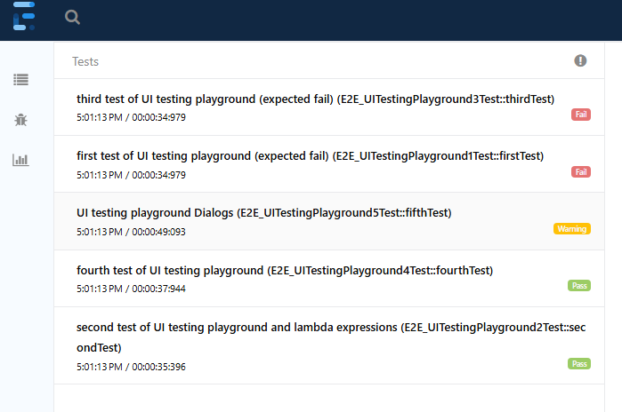

## Configure Run/Debug Templates
Other test suites can be configued in a similar manner, as described above.

