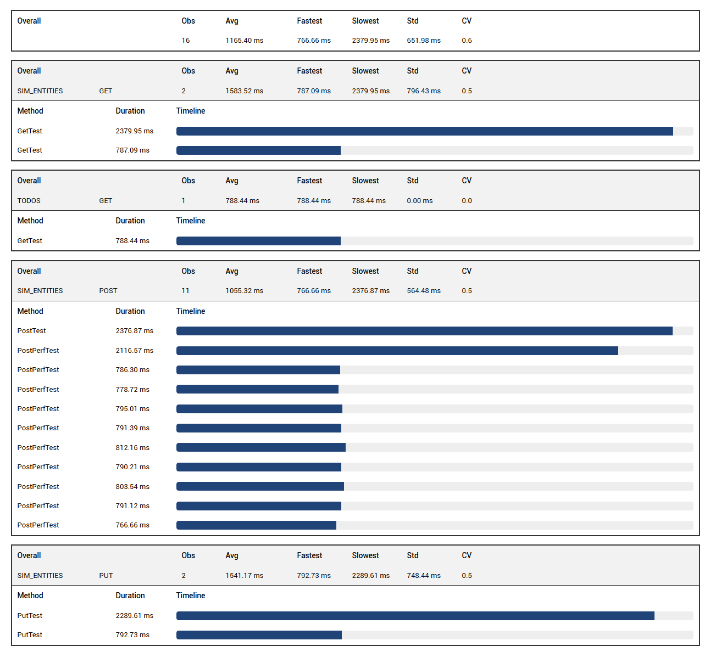
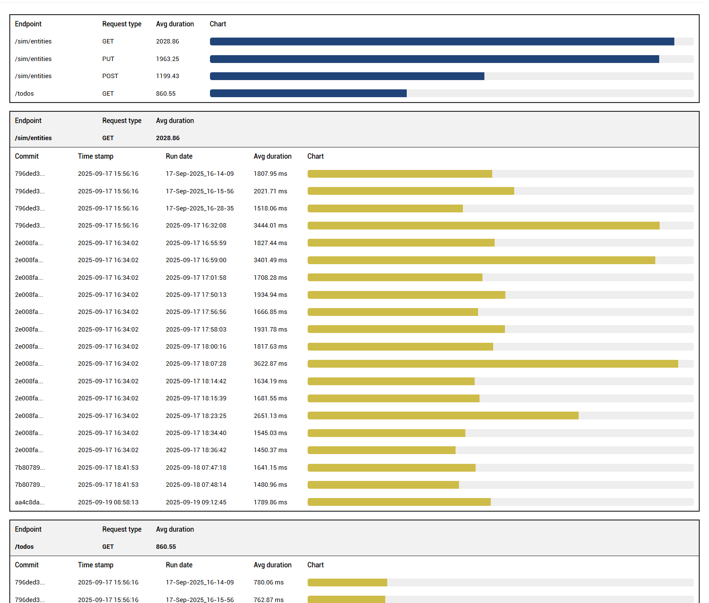

# Performance Testing

QED's performance testing framework leverages Kotlin coroutines for realistic, concurrent load simulation. With built-in telemetry, stress-level control, and markdown-friendly reporting, it enables longitudinal performance tracking with minimal ceremony.

---

## Structure

The core of a performance test is the `PerformanceTestContext`, an extension of `TestContext`. A performance test is structured in two parts:

- a coroutine block that executes the test logic, and
- a control block that manages the concurrent execution of those coroutines

```kotlin
private val baseTest = BaseTest()
private val hasRest = HasRest(baseTest, urlKey = "url")

private class APIChallengesPerformanceTest : PerformanceTestContext(baseTest, null,
    hasRest, stressLevel = StressLevel.BASELINE) {

    @Test(priority = 0, description = "Concurrent POST test with jitter", groups = ["All"])
    fun Post1Test() = runConcurrentTest("Post1Test") {
        logger.info { "StressLevel: $stressLevel" }
        logger.info { "START TEST" }

        coroutineScope {
            val jobs = (0..9).map {
                launch(ctx) {
                    delay(Random.nextLong(10, 100)) // jitter makes simulation more realistic
                    doPost(it)
                }
            }
            jobs.joinAll()
        }

        logger.info { "END TEST" }
    }
}
```

---

## Setup Guide

- **Use `PerformanceTestContext`** instead of `TestContext`. The constructor parameters are the same (e.g., `HasBrowser?`, `HasRest?`).
- **Annotate the test function** with `@Test` and wrap it in `= runConcurrentTest(name)`.
- **Use `coroutineScope`** for structured concurrency.
- **Launch coroutines** using `launch(Dispatchers.IO + coroutineContext) { ... }`. In the example above this is done via `val jobs = ...`, where `doPost` is the coroutine that executes the test logic.
- **Stress Level Control** — `stressLevel = StressLevel.BASELINE` (default) gives a realistic load simulation. `StressLevel.STRESS` floods the IO pools and produces an unrealistic load.
- **Call `jobs.joinAll()`** to wait for all coroutine instances to finish.
- It is good practice to log the current stress level at the start of each test run.

---

## Coroutine Setup

```kotlin
suspend fun doPost(index: Int) = withIOContext {
    delay(Random.nextLong(10, 100)) // jitter in ms
    val json = generatePayload(index)
    val result = rest.sendUntyped(RequestType.POST, APIChalURLPath.SIM_ENTITIES, json, 201, trackPerformance = true)

    val logger = currentCoroutineContext()[LoggerContext]?.logger ?: error("LoggerContext missing")
    logger.info { "POST #$index executed in coroutine" }

    verify("check response body for name=bob and id=11") {
        expect(result.get("name")).to.equal("bob")
        expect(result.get("id")).to.equal(11)
    }
}
```

Key elements:

- **`suspend`** — marks the function as suspendable, so it can be paused and resumed without blocking the thread
- **`= withIOContext { ... }`** — ensures execution runs on the IO dispatcher
- **`trackPerformance = true`** — every `rest.send` request with this flag set will be tracked for performance

---

## Performance Test Execution Report

If at least one `rest.send` request in the suite has `trackPerformance = true`, QED automatically generates a performance report. The performance summary appears at the bottom of the left-hand test list in Extent Reports, labelled **"Performance Summary"**.

The report shows a top bar with the pooled average duration across all tracked requests, and a breakdown by endpoint and request type.



---

## Performance History Report

You can configure how long run history is retained in terms of commits and runs per commit. Add the following to your project's config file:

```json
"testrunmetadata": {
    "repository": "C:\\Projects\\qed",
    "sut": "apichallenges",
    "maxRunsPerCommit": 5,
    "maxCommitsToKeep": 20
}
```

- `repository` — path to the repo, used to retrieve the latest commit number
- `sut` — name of the system under test, used as the subdirectory name under `<QED>/perf-history/` where JSON history files are stored (e.g. `<QED>/perf-history/apichallenges`)

History retention is based on commit lineage and capped by `maxRunsPerCommit` and `maxCommitsToKeep`, ensuring meaningful trend analysis without bloating the report directory.

The history chart shows the variation in average response time per test run for each endpoint and request type.

